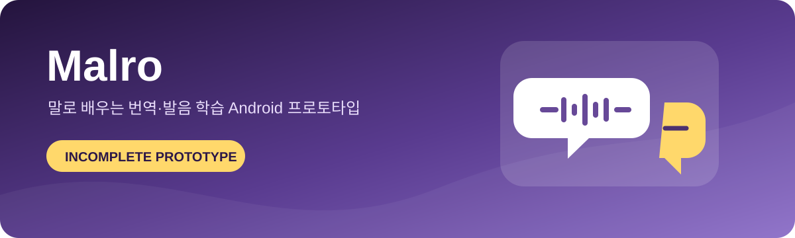
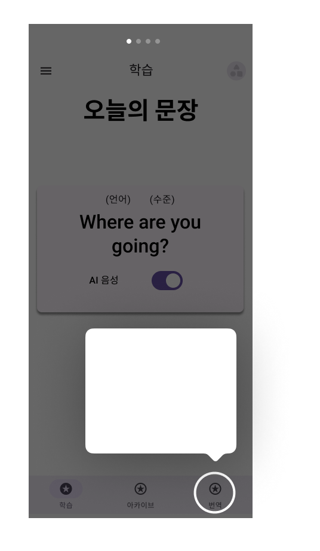
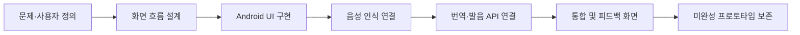

# Malro

  

> 자연어 처리와 음성 API를 활용해 번역·말하기·발음 교정을 한 흐름으로 연결하려 한 가천대학교×세종대학교 학술제 팀 프로젝트입니다.

## 프로젝트 설명

외국어 문장을 읽고 말하는 과정에서 학습자가 즉시 번역과 발음 피드백을 받을 수 있는 Android 학습 앱을 기획했습니다. 오늘의 문장, 문장 연습, 번역, 음성 입력과 피드백 화면을 중심으로 사용자 흐름을 설계했으며 Java와 Firebase를 기반으로 프로토타입을 구현했습니다.

  

## 주요 기능

- 오늘의 문장 학습
- 음성 입력과 Speech-to-Text 변환
- 외국어·표준어 번역
- 문장 단위 말하기 연습
- 발음 결과와 피드백 화면
- 학습·아카이브·번역 중심의 하단 탐색 구조

## 기술 구성

| 영역 | 사용 기술 | 목적 |
|---|---|---|
| Android | Java, Android Studio | 화면과 사용자 흐름 구현 |
| Data | Firebase | 사용자 및 학습 데이터 연동 계획 |
| Speech | Google Speech-to-Text | 음성 인식 |
| Translation | Microsoft Azure | 문장 번역 |
| Pronunciation | The Fluent API | 발음 평가 연동 |

## 개발 과정

프로젝트 초기에 발음과 소통을 돕는 핵심 문제를 정의하고, 학습·아카이브·번역을 주요 탐색 축으로 설계했습니다. 이후 각 외부 API를 `BuildConfig` 기반 설정으로 분리해 연결했지만, 일정 내 전체 기능과 빌드 구성을 완성하지 못해 소스 스냅샷 단계에서 종료했습니다.

## 담당 역할

- 팀장으로 프로젝트 계획과 일정 조율
- 핵심 기능과 사용자 흐름 설계
- 서비스 구조 및 외부 API 연동 방향 결정
- 백엔드·데이터 연동 코드 일부 구현

## 현재 상태

이 저장소는 완성된 애플리케이션이나 배포 가능한 결과물이 아닙니다. 보존된 범위는 주로 `app/src/main`이며 Gradle 루트 설정과 일부 서비스 구성이 누락되어 그대로 빌드되지 않을 수 있습니다. 미완성이라는 사실을 명확히 남기고, 당시의 기획·설계·구현 경험을 기록하기 위한 저장소입니다.

## 프로젝트 범위 및 유의사항

외부 구성요소와 자료의 출처·이용 조건은 [THIRD_PARTY_NOTICES.md](THIRD_PARTY_NOTICES.md)를 참고하세요.

- 학술제 팀 프로젝트의 학습·포트폴리오용 아카이브입니다.
- 별도의 오픈소스 라이선스를 부여하지 않았으며 재사용·재배포 허가를 의미하지 않습니다.
- 전체 결과물은 팀 공동 작업이며 담당 역할은 개인 기여 범위를 나타냅니다.
- API 키, Firebase 설정, 사용자 데이터, 개인 정보와 인증서 지문은 저장소에서 제외했습니다.
- 음성 인식·번역·발음 평가는 외부 API 사양과 서비스 상태에 영향을 받습니다.
- 정확성, 접근성, 개인정보 보호, 운영 안정성을 검증한 상용 서비스가 아닙니다.
